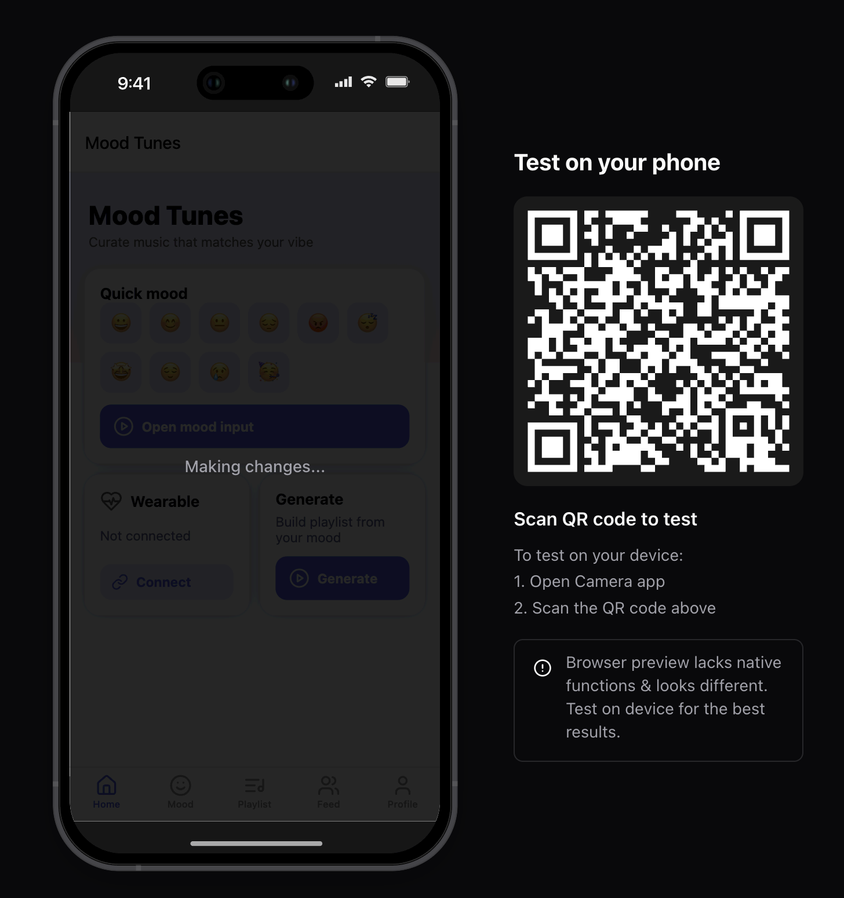
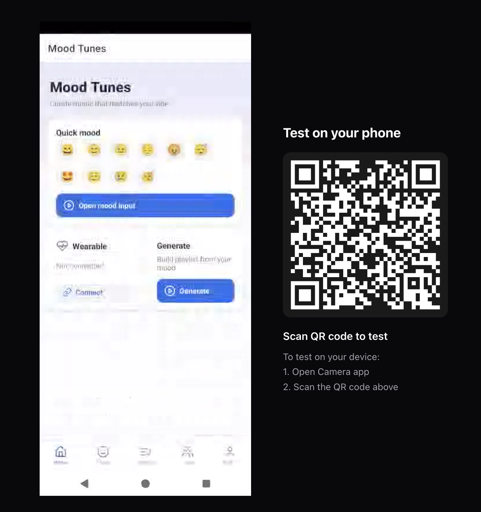

# Mood Tunes

Curate music that matches your vibe — *Mood Tunes* is a music and wellness web app that generates playlists from your emotional input or biometric data.

---

## Preview

**iOS Preview:**



**Android Preview:**



---

## Features

- **Quick Mood Input** — Select your mood instantly using emoji buttons.
- **Detailed Mood Input** — Use sliders for *Energy* and *Valence* or journal your current feelings.
- **Wearable Integration** *(Coming Soon)* — Connect supported devices to sync biometric data (e.g., heart rate).
- **Playlist Generation** — Build playlists tailored to your mood.
- **Social Feed** — View and interact with community-shared playlists.
- **Profile Management** — Save playlists, manage connected devices, and set sharing preferences.

---

## Tech Stack

- **Frontend:** React 18 + Tailwind CSS
- **Design:** Mobile-first responsive UI with a calming gradient theme
- **Potential Integrations:** Spotify API, Fitbit API, Web Bluetooth for wearables

---

## Installation & Setup

1. Clone the repository:

```bash
git clone <repository-url>
cd mood-tunes
```

2. Open `index.html` in your browser *(for the static prototype)*, or integrate into a React + Vite setup for production:

```bash
npm create vite@latest mood-tunes
cd mood-tunes
npm install
tailwindcss init -p
npm run dev
```

---

## Usage

- **Home Tab** — Quick mood selection & wearable connection option
- **Mood Tab** — Detailed mood sliders & journaling
- **Playlist Tab** — View generated playlists, save or share
- **Feed Tab** — Discover community playlists
- **Profile Tab** — Manage account settings and preferences

---

## Development Notes

- Current build uses mock playlist generation (static data).
- Backend integration needed for live playlist data & social feed.
- Wearable connection placeholder ready for Fitbit/Web Bluetooth integration.

---

## License

MIT License — feel free to use and adapt.

---

## Author

Developed by **[Your Name]** — Designed with a focus on music, wellness, and user mood tracking.
